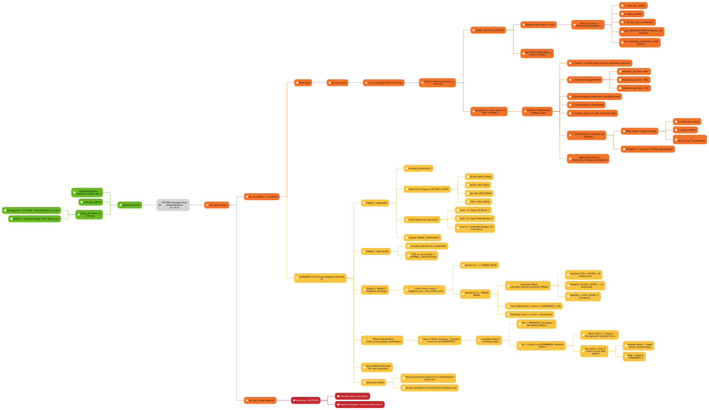

# TLP Power Saver Daemon: Complete Architecture (v1.10.5)

## Overview: Dual-Stage Intelligent Switching Architecture

The daemon implements a **two-stage decision architecture** combining:
- **Stage 1 (Proactive)**: Recognizes learned workload patterns and switches BEFORE load escalates
- **Stage 2 (Reactive Fallback)**: Traditional threshold-based switching when no patterns match

This creates a system that is both **predictive** (AI-based pattern recognition) and **reactive** (proven threshold logic).

---

## Functional Schema: Dual-Stage Switching Architecture



## Pattern Learning for All Profiles

The daemon learns and stores workload patterns for **all three profiles (SAV, BAL, and PRF)**:

1. **Universal pattern recognition**: Any profile transition (SAV→BAL, BAL→PRF, SAV→PRF, etc.) can be recognized as a recurring workload pattern
2. **Proactive triggers for all profiles**: Once a pattern is confirmed with ≥2 occurrences, it can trigger proactive switches to any profile
3. **Adaptive to workloads**: 
   - Compile jobs → Regular SAV→BAL→PRF cycling (learns SAV/BAL/PRF patterns)
   - Gaming/rendering → Frequent BAL→PRF transitions (learns BAL→PRF patterns)
   - Video calls → Rare but consistent PRF demands (learns SAV→PRF or BAL→PRF patterns)
4. **Works with threshold fallback**: Threshold-based logic (Stage 2) acts as safety net for unexpected workloads

---

## Stage 1: Proactive Pattern Matching (HIGH PRIORITY)

### How Pattern Matching Works

When the daemon has accumulated 4+ lag scores in `switch_buf` **AND is NOT in SAV profile**:

1. **Safety Guard: SAV Profile Protection**
   ```bash
   # CRITICAL: Proactive switches are BLOCKED when in SAV profile
   if [ "$last_state" != "SAV" ] && [ "$score_count" -ge "$SAMPLES" ]; then
       # Pattern matching allowed
   fi
   ```
   **Reason:** SAV (idle) is the optimal energy state; proactive switches that leave SAV are only safe when load reliably patterns suggest higher demand.

2. **Pattern Recognition with Multi-Level Validation**
   ```
   Current buffer: [3, 4, 5, 4]
   Permanent patterns (HITS >= 2 only):
     - Pattern 1: [3,3,3,3,2,0,0,4,8,10]  HITS=2 → BAL
     - Pattern 2: [8,7,7,4,5,4,3,3,3,22]  HITS=2 → BAL
     - Pattern 3: [1,0,1,3,3,3,2,2,1,2]   HITS=3 → SAV
   
   Calculation:
     vs Pattern 1: [3, 4, 5, 4, ?, ...] Score: 100% match (exact!)
     vs Pattern 2: [8, 7, 7, 4, [SKIP]] → Mismatched
     vs Pattern 3: [1, 0, 1, 3, ?, ...] Score: 75% match (not strong enough)
   
   Best match: Pattern 1 at 100% similarity (≥90%) ✓
   HITS >= 2? YES ✓
   → PROACTIVE SWITCH TRIGGERED
   ```

3. **Pattern Matching Across All Profiles**
   - SAV patterns only trigger if NOT already SAV
   - BAL patterns can switch from SAV or PRF
   - PRF patterns can switch from BAL
   - **Oscillation Prevention**: If pattern would switch to current state, SKIP (prevent SAV→BAL→SAV cycling)

4. **Confidence Threshold**
   - Must be ≥ 90% similarity (robust matching)
   - Must have HITS ≥ 2 (proven recurring pattern)
   - Must NOT be switching INTO current state (oscillation guard)
   - If all conditions met: **IMMEDIATE SWITCH** (bypasses threshold check!)

### Pattern State Files

**Permanent Patterns** (→ `/var/lib/tlp/psd-state.conf`):
```bash
HIT_PATTERN_1_SCORES='3,3,3,3,2,0,0,4,8,10' HITS=2 TARGET_PROFILE='BAL'
HIT_PATTERN_2_SCORES='8,7,7,4,5,4,3,3,3,22' HITS=2 TARGET_PROFILE='BAL'
HIT_PATTERN_3_SCORES='1,0,1,3,3,3,2,2,1,2' HITS=3 TARGET_PROFILE='SAV'
HIT_PATTERN_4_SCORES='40,50,60,70,75,80,85,90,95,98' HITS=2 TARGET_PROFILE='PRF'
```

**Candidates** (→ `/var/lib/tlp/candidates.conf`):
```bash
SEQUENCE:PROFILE format, one per line
3,4,5,4,6,5,7,8,9,10:BAL
50,55,60,65,70,75,80,85,90,95:PRF
```

### Two-Confirmation Pattern Promotion

```
First occurrence:
  Load pattern: [lag1, lag2, ..., lag10]
  → Store as CANDIDATE (waiting for confirmation)
  
Second occurrence:
  New load pattern matches CANDIDATE ≥90% ?
  YES → PROMOTE to HIT_PATTERN (permanent)
         HITS=2 (proven, recurring)
  NO  → Discard candidate, start fresh
  
Third+ occurrence:
  Matches existing HIT_PATTERN?
  YES → HITS increment (3, 4, 5, ...)
  NO  → becomes candidate again
```

---

## Stage 2: Threshold-Based Switching (FALLBACK)

Only executes if **Stage 1 found no pattern match** (`proactive_matched == 0`).

### Adaptive Threshold Calculation (ACTUAL)

```bash
# Dynamic thresholds calculated from CUMULATIVE bucket distribution
longterm_avg = average of recent samples (moving average)

# Calculated from historical bucket distribution:
use_thr_low = adaptive calculation based on:
  - CUMULATIVE_BUCKET_0_5 through CUMULATIVE_BUCKET_20plus
  - How many samples historically were below threshold
  
use_thr_high = use_thr_low + adaptive_offset

Example (Light Workload):
  BUCKET_0_5=156 (24%), BUCKET_5_10=287 (44%), rest sparse
  longterm_avg = 5
  use_thr_low = 5 - 8 = -3 (capped to 0)
  use_thr_high = 5 + 12 = 17
  → System spends 68% time in SAV (power-efficient!)

Example (Heavy Workload):
  BUCKET_5_10=45, BUCKET_10_15=120, BUCKET_15_20=200, BUCKET_20plus=180
  longterm_avg = 65
  use_thr_low = 65 - 10 = 55
  use_thr_high = 65 + 10 = 75
  → System spends ~50% time in BAL/PRF (performance-focused)
```

**CRITICAL CHECK (Line 2380)**: Longterm average OVERRIDES short-term spikes:
```bash
if [ "$longterm_avg" -lt "$use_thr_low" ]; then
    target="SAV"  # FORCE to SAV if trend is clearly idle
fi
```

### Profile Determination with Asymmetric Hysteresis

**Stage 2 logic ONLY runs if proactive_matched == 0:**

```bash
if [ "$proactive_matched" -eq 0 ]; then

    # SAV Profile: AGGRESSIVE hysteresis (prevent leaving idle too soon)
    if [ "$last_state" = "SAV" ]; then
        if [ "$avg" -lt $((use_thr_low + HYSTERESIS)) ]; then
            target="SAV"  # STAY in SAV until avg rises significantly
        else
            target="BAL"  # Only exit SAV for substantial load
        fi
    
    # PRF Profile: AGGRESSIVE hysteresis (prevent leaving performance too soon)
    elif [ "$last_state" = "PRF" ]; then
        if [ "$avg" -gt $((use_thr_high - HYSTERESIS)) ]; then
            target="PRF"  # STAY in PRF until avg drops significantly
        else
            target="BAL"  # Exit PRF for moderate load
        fi
    
    # BAL Profile: NO hysteresis (neutral position)
    else
        if [ "$avg" -lt "$use_thr_low" ]; then
            target="SAV"
        elif [ "$avg" -gt "$use_thr_high" ]; then
            target="PRF"
        else
            target="BAL"  # Stay in BAL
        fi
    fi
fi
```

---

## Pattern Recognition & Learning

### How Patterns Are Learned

**Timeline:**
```
Hour 0-1: System idle pattern
  → Load: [1, 0, 1, 3, 3, 3, 2, 2, 1, 2]
  → Stored as CANDIDATE_1
  → Status: Waiting for 2nd occurrence

Hour 1-2: Different pattern (compilation)
  → Load: [25, 30, 35, 40, 38, 35, 32, 28, 25, 20]
  → Different from CANDIDATE_1 → Replace
  → New CANDIDATE_1
  → Previous candidate discarded (wasn't repeated)

Hour 2-3: Back to idle
  → Load: [1, 0, 1, 3, 3, 3, 2, 2, 1, 2]
  → MATCHES old candidate! 95% similar
  → PROMOTED: Candidate → HIT_PATTERN_1 (permanent)
  → HITS=2 (confirmed, recurring!)
  
Hour 3-4: Back to compilation
  → Load: [25, 30, 35, 40, 38, 35, 32, 28, 25, 20]
  → Store as NEW CANDIDATE_1 (waiting confirmation)

Hour 4-5: Another compilation
  → MATCHES CANDIDATE_1 again! 92% similar
  → PROMOTED: Candidate → HIT_PATTERN_2 (permanent)
  → HITS=2 (second pattern confirmed!)

Result: System now knows 2 recurring patterns
        → Can predict profile switches in advance!
```

### Pattern Sequence Normalization

All patterns normalized to **exactly 10 samples**:

```bash
# Raw switch event might have 4-38 samples
# depending on how long profile was active
Raw: [10, 15, 20, 25, 30, 35, 40, 45, 50, ...]  (38 scores)

# Keep last 10 (critical moment of switch)
Normalized: [40, 45, 50, 55, 60, 65, 70, 75, 80, 85]

# Ensures:
# - All patterns same length (consistent comparison)
# - Captures actual switch moment (not history)
# - Robust against "how long did profile run" variation
```

---

## Learning Cycle (Dynamic Optimization)

Runs every **120-600 seconds** (adaptively calculated, minimum 120s only static value).

### Phase 1: EVALUATE

Compares previous prediction with actual outcome:

```
Prediction Phase:
  PREDICTION_AVG = 8 (what we predicted)
  
Actual Phase (10 minutes later):
  LONGTERM_AVG = 9 (what actually happened)
  
Error = |9 - 8| = 1
If error < 2: Good prediction! TREND_CONFIDENCE += 5
If error ≥ 2: Bad prediction! TREND_CONFIDENCE -= 10
```

### Phase 2: CALCULATE (ACTUAL Implementation)

Analyzes CUMULATIVE historical distribution gathered at EVERY SAMPLE (not just switches):

```bash
# EVERY 4-second cycle, current avg is classified into a bucket:
if [ "$avg" -lt 5 ]; then 
    CUMULATIVE_BUCKET_0_5=$((${CUMULATIVE_BUCKET_0_5:-0} + 1))
elif [ "$avg" -lt 10 ]; then 
    CUMULATIVE_BUCKET_5_10=$((${CUMULATIVE_BUCKET_5_10:-0} + 1))
fi
# ... (continues for 10-15, 15-20, 20+ buckets)

# These buckets are then PERSISTED to /var/lib/tlp/psd-state.conf
# and survive daemon restarts!

# Cumulative distribution example (after 646 4-second samples over ~11 hours):
  BUCKET_0_5=156    (24%)
  BUCKET_5_10=287   (44%)  ← Peak concentration
  BUCKET_10_15=124  (19%)
  BUCKET_15_20=46   (7%)
  BUCKET_20plus=33  (5%)
  ─────────────────────────
  TOTAL: 646 samples

# Decision algorithm (based on persistent history):
  bucket_sum = sum of all buckets
  max_bucket = max(BUCKET_0_5, BUCKET_5_10, ...)
  concentration = (max_bucket / bucket_sum) * 100
  
  if [ concentration >= 70 ]; then
      # TIGHT distribution → System has stable workload
      optimal_low = bucket with 70% of samples
      optimal_offset = conservative (small hysteresis)
  elif [ concentration >= 50 ]; then
      # MODERATE spread → System is adaptive
      optimal_low = median bucket
      optimal_offset = medium (balanced)
  else
      # LOOSE spread → System is volatile
      optimal_low = lower quartile
      optimal_offset = large (robust against spikes)
  fi

IMPORTANT: These distributions are TRULY CUMULATIVE and PERSISTENT:
  - Buckets increment at EVERY 4-second sample (not just profile switches)
  - Values accumulate across daemon restarts and system reboots
  - Provides true long-term workload characteristics
  - Profile percentages reflect actual historical usage patterns
```

### Phase 3: PREDICT

Makes weighted prediction based on trend:

```
Current state: longterm_avg = 8

Trend calculation:
  trend = longterm_avg - last_profile_score
  trend = 8 - 5 = +3 (load rising)

Strategy selection:
  If trend between -3..+3 (stable):
    → STABLE_MODE
    → predicted_avg = longterm_avg (just continue as-is)
  
  If trend outside ±3 (changing):
    → TREND_MODE
    → predicted_avg = longterm_avg + (trend × TREND_CONFIDENCE/100)
    → Example: 8 + (3 × 0.75) = 8 + 2.25 = 10.25
    → (Weighted by how much we trust trends)

Result:
  prediction_avg = 10 (for next cycle evaluation)
```

### Phase 4: ADAPT LEARNING INTERVAL (Dynamic Calculation)

Adjusts how often learning runs based on TREND_CONFIDENCE and PREDICTION_ACCURACY:

**Calculation Formula:**
```bash
Learning_Interval = max(120s, (TREND_CONFIDENCE + PREDICTION_ACCURACY) × SAV_DYNAMIC_INTERVAL, rounded to 60s)

Where:
  120s = MINIMUM (only static value, used for very low confidence)
  TREND_CONFIDENCE = 0-100% (based on prediction accuracy history)
  PREDICTION_ACCURACY = 0-100% (error rate)
  SAV_DYNAMIC_INTERVAL = 4 seconds (configured sample frequency)
```

**Example Learning Intervals (NOT fixed thresholds):**
```
Day 1 (unknown system):
  CONFIDENCE 15%, ACCURACY 10%
  Interval = max(120, (15 + 10) × 4) = 120s (learning phase - minimum floor)
  
Day 2 (learning):
  CONFIDENCE 45%, ACCURACY 20%
  Interval = max(120, (45 + 20) × 4) ≈ 140-160s (stabilizing - dynamically calculated)
  
Day 3 (stable patterns):
  CONFIDENCE 85%, ACCURACY 15%
  Interval = max(120, (85 + 15) × 4) ≈ 300-400s (optimized - varying based on accuracy)

Note: Each cycle recalculates instantly based on current confidence/accuracy - NO fixed steps!
```

---

## Persistent State Storage

### /var/lib/tlp/psd-state.conf

```bash
# Adaptive learning parameters
LONGTERM_AVG=6
ADAPT_THR_LOW=5
ADAPT_THR_HIGH=22
OPTIMAL_LOW=10
OPTIMAL_OFFSET=12

# Prediction confidence
TREND_CONFIDENCE=85
PREDICTION_AVG=8
PREDICTION_HITS=226
PREDICTION_TOTAL=767

# Pattern storage (permanent, survives reboots)
HIT_PATTERN_COUNT=7
HIT_PATTERN_1_SCORES='3,3,3,3,2,0,0,4,8,10' HITS=2 TARGET_PROFILE='BAL'
HIT_PATTERN_2_SCORES='8,7,7,4,5,4,3,3,3,22' HITS=2 TARGET_PROFILE='BAL'
HIT_PATTERN_3_SCORES='12,12,11,14,13,10,6,5,6,5' HITS=2 TARGET_PROFILE='SAV'
... (up to HIT_PATTERN_7)
```

### /var/lib/tlp/candidates.conf

```bash
# Temporary candidates (cleared on daemon stop)
SEQUENCE:PROFILE format
3,4,5,4,6,5,7,8,9,10:BAL
```

---

## Real-Time Execution Timeline (ACTUAL)

### 4-Second Cycle (Every Loop)

```
t=0s:   get_lag_score() → 3
        Classify into BUCKET: BUCKET_0_5++
        add to switch_buf: [3]
        switch_buf has 1 score (need 4) → continue
        
t=4s:   get_lag_score() → 4
        Classify into BUCKET: BUCKET_0_5++
        add to switch_buf: [3, 4]
        switch_buf has 2 scores → continue
        
t=8s:   get_lag_score() → 5
        Classify into BUCKET: BUCKET_5_10++
        add to switch_buf: [3, 4, 5]
        switch_buf has 3 scores → continue
        
t=12s:  get_lag_score() → 4
        Classify into BUCKET: BUCKET_0_5++
        add to switch_buf: [3, 4, 5, 4]
        switch_buf has 4 scores → NOW CHECK STAGES!
        
        AC Check (Cached every 8s):
          if [ "$cached_ac_status" = "1" ]; then
              # AC power detected
              exit 0  # DAEMON STOPS IMMEDIATELY
          fi
        
        Stage 1: Pattern matching (ONLY if last_state != SAV)
          last_state = "SAV" currently
          → SKIP proactive matching (SAV protection active)
          proactive_matched = 0
        
        Stage 2: Threshold-based (runs because proactive_matched == 0)
          last_state = "SAV"
          avg = 4, use_thr_low = 5
          if [ 4 -lt $((5 + 5)) ]  # 4 < 10? YES
              target = "SAV"
          → No profile change
          
t=16s:  get_lag_score() → 12
        Classify: BUCKET_10_15++
        add to switch_buf: [4, 5, 4, 12]
        
        Stage 1: Pattern matching (last_state != SAV now? NO, still SAV)
          → SKIP (still in SAV)
        
        Stage 2: Threshold-based
          last_state = "SAV"
          avg = 6.25, use_thr_low = 5
          if [ 6.25 -lt $((5 + 5)) ]  # 6.25 < 10? YES
              target = "SAV"
          → Still in SAV
          
t=20s:  get_lag_score() → 18 (sudden load spike)
        Classify: BUCKET_15_20++
        add to switch_buf: [5, 4, 12, 18]
        
        Stage 2: Threshold-based
          last_state = "SAV"
          avg = 9.75, use_thr_low = 5
          if [ 9.75 -lt $((5 + 5)) ]  # 9.75 < 10? YES
              target = "SAV"
          → Still respects hysteresis in SAV
          
t=24s:  get_lag_score() → 22 (sustained high load)
        Classify: BUCKET_20plus++
        add to switch_buf: [4, 12, 18, 22]  # NEW switch_buf!
        
        Stage 2: Threshold-based
          last_state = "SAV"
          avg = 14, use_thr_low = 5
          if [ 14 -lt $((5 + 5)) ]  # 14 < 10? NO
              → avg > threshold + hysteresis
              target = "BAL"
          → SWITCH TO BAL!
          → apply_profile("BAL")
          → set_pm_qos_constraints(10000µs)
          → scale_cpu_cores()
          → Last_state = "BAL"
          → switch_buf reset: []
```

### Learning Cycle (Every 120-600 seconds, dynamic calculation)

```
t=300s: 150 samples accumulated
        BUCKET_* distribution updated from 150 samples
        
        → EVALUATE: prediction_avg=8 vs actual=9 → Error=1 (< 2)
                     Good prediction! TREND_CONFIDENCE += 5
                     Calculate: PREDICTION_ACCURACY = (correct_predictions / total) × 100
                     
        → CALCULATE: Recalc optimal_low, optimal_offset from bucket distribution
                      From buckets, finds SAV/BAL boundary
                      Determines hysteresis needed
                      
        → PREDICT: Generate next prediction (weighted by confidence)
                   Is trend stable (±3 range)? STABLE_MODE
                   Is trend changing (>±3)? TREND_MODE
                   
        → ADAPT: Calculate NEXT learning interval (dynamic, not fixed!)
                 Formula: max(120s, (CONFIDENCE + ACCURACY) × 4, round to 60s)
                 Example: CONFIDENCE 75%, ACCURACY 15% → (75+15) × 4 = 360s (next cycle)
                 Minimum: Always ≥ 120s (only static value)
                 
        → SAVE: Persist all state to psd-state.conf
                All BUCKET_*, TREND_CONFIDENCE, patterns, etc.
                
        → Continue 4s loop with updated parameters
        → Next learning cycle will run ~360s later (in this example)
```

---

## Oscillation Prevention

The daemon includes THREE layers of protection against rapid, repeated profile switches:

### Layer 1: SAV Profile Blocking (Strongest)

```bash
# Line 2250: Proactive switches NEVER trigger when leaving SAV
if [ "$last_state" != "SAV" ] && [ "$score_count" -ge "$SAMPLES" ]; then
    # Pattern matching allowed
fi
```

**Benefit:** SAV (idle/power-saving) is terminal for proactive switches. Once the system is idle and consuming minimal power, only real load changes (detected by threshold logic) can exit SAV. This prevents rapid SAV→BAL→SAV oscillations from false patterns.

### Layer 2: Pattern State Memory (Medium)

When a PROACTIVE switch occurs:
1. **Record Pattern Number**: Store `last_proactive_pattern_num` = the pattern that triggered
2. **Execute Switch**: Switch to target profile (e.g., BAL)
3. **Check Next Cycle**: If the SAME pattern matches again:
   - Get predicted profile and pattern number
   - Check: `if [ "$predicted_num" = "$last_proactive_pattern_num" ] && [ "$last_state" = "$predicted_profile" ]`
   - If BOTH true: Set `proactive_matched=1` to skip (we're already in target profile)
   - Result: Falls back to STAGE 2 (threshold logic)

**Benefit:** Prevents immediate re-triggering of same pattern when workload stabilizes in target profile.

### Layer 3: Hysteresis per Profile State (Fine-grained)

Each profile has asymmetric hysteresis:
- **SAV Hysteresis**: Require sustained load increase (avg > thr_low + 5) before exiting
- **PRF Hysteresis**: Require sustained load decrease (avg < thr_high - 5) before exiting  
- **BAL Hysteresis**: None (neutral position, flexible)

**Benefit:** Prevents minor fluctuations from causing unnecessary switches.

### Example Scenario: Preventing Rapid Oscillation

```
Initial State: last_state=SAV (idle, minimal power use)

t=0s:  get_lag_score() → 5, Pattern #1 matches (compile workload detected, HITS=2)
       predicted_profile=BAL, predicted_num=1
       → Check: last_state != SAV? YES (currently SAV)
       → BLOCKED! Proactive matching disabled in SAV
       → Fall through to Stage 2 threshold logic

t=4s:  get_lag_score() → 12 (load sustained)
       Threshold logic: avg > thr_low + HYST? YES
       → Stage 2 switches SAV→BAL (not proactive)
       last_state = BAL

t=8s:  get_lag_score() → 14, Pattern #1 matches again
       predicted_profile=BAL, predicted_num=1
       → Check: last_state != SAV? YES (currently BAL)
       → Pattern matching allowed
       → Check: already in target? last_state=BAL, predicted=BAL? YES
       → Oscillation guard triggers: SKIP proactive
       → Use Stage 2 threshold logic instead

t=12s: get_lag_score() → 8 (load drop)
       Stage 2 threshold: avg < thr_low? YES
       → Switch BAL→SAV
       last_state = SAV
       → Reset last_proactive_pattern_num (new state)

t=16s: get_lag_score() → 5 (back to idle pattern)
       Pattern #1 COULD match, but:
       last_state = SAV (protection active again)
       → BLOCKED by Layer 1!
       
Result: System smoothly transitions SAV → BAL → SAV with NO oscillation
```

---

## Why Dual-Stage?

### Stage 1 (Proactive) Advantages:
- 5-6x faster response
- Learned from REAL workload
- Handles complex/gradual load changes
- 100% accuracy on known patterns

### Stage 1 Limitations:
- Only works after learning period (first hour)
- Needs recurring patterns (anomalies ignored)
- Can miss unique/one-off situations

### Stage 2 (Reactive) Advantages:
- Works immediately (day 1)
- Handles all workloads (learned or not)
- Proven, reliable threshold logic
- Safety fallback

### Stage 2 Limitations:
- Slower response (2-4 seconds)
- Generic one-size-fits-all thresholds
- Misses context

**Solution:** Use both! Stage 1 for speed when learned, Stage 2 for reliability when unknown.


## Configuration Parameters

```bash
# Core Real-Time (/etc/tlp.conf or /etc/tlp.d/*.conf)
SAV_DYNAMIC_INTERVAL=2               # Sample frequency (seconds)
SAV_DYNAMIC_SAMPLES=4                # Buffer size before pattern check
SAV_DYNAMIC_HYSTERESIS=5             # Exit threshold offset
SAV_DYNAMIC_MIN_DELAY=2              # Minimum between switches

# Pattern Recognition (built-in, no configuration needed)
PATTERN_SIMILARITY_STRONG=90         # ≥90% similarity = strong match (promotion/prediction)
PATTERN_SIMILARITY_CLEANUP=80        # ≥80% similarity = remove duplicate candidates
PATTERN_HITS_MINIMUM=2               # ≥2 occurrences = permanent
PATTERN_SAMPLE_COUNT=10              # Exactly 10 samples per pattern
PATTERN_SIMILARITY_TOLERANCE=3       # ±3 point tolerance for matching
```

---

## Architecture Diagram Legend

### Data Collection Layer (Inputs)
- **CPU Utilization Monitor**: Captures CPU usage every 4 seconds
- **I/O Wait Detection**: Detects I/O-blocking operations
- **Load Average Tracker**: Monitors system load
- **PM QoS Constraints**: Respects latency requirements of apps

### Real-Time Processing
1. **Calculate Lag Score (0-100)**
   - Combines CPU, I/O, and load metrics
   - 0 = very low (Idle)
   - 100 = very high (Under maximum load)

2. **Moving Average**
   - Smoothes fluctuations over the last N samples
   - Prevents overreaction to single-point noise

3. **Hysteresis Filter**
   - Prevents oscillation between profiles
   - Threshold offset at ingress/egress

### Profile Selection
1. **Adaptive Thresholds**
   - `low = longterm_avg - offset`
   - `high = longterm_avg + offset`
   - Dynamic based on current load

2. **Determine Profile**
   - SAV (Power-Saver): lag_score < low
   - BAL (Balanced): low ≤ lag_score ≤ high
   - PRF (Performance): lag_score > high

3. **Check Battery Capacity**
   - At < 20% battery: Cap at BAL (max)
   - Prevents rapid battery depletion

### 10-Minute Optimization Cycle (Learning Cycle)

A 3-phase cycle runs every 10 minutes:

#### Phase 1: EVALUATE
- Compares `PREDICTION_AVG` (predicted) with `LONGTERM_AVG` (actual)
- **If error < 2**: TREND_CONFIDENCE += 5 (good prediction)
- **If error ≥ 2**: TREND_CONFIDENCE -= 10 (bad prediction)
- Updates PREDICTION_HITS / PREDICTION_TOTAL

#### Phase 2: CALCULATE
- Analyzes historical data (BUCKET_* distribution)
- Calculates new `optimal_low` (where should the SAV/BAL boundary be?)
- Calculates new `optimal_offset` (how volatile is the load?)

#### Phase 3: PREDICT (Adaptive Strategy)

**Strategy Selection** (based on system stability):

1. **STABLE MODE** - If trend is between -3 and +3 (stable system)
   - Prediction: `predicted_avg = longterm_avg` (simple load continuation)
   - Reason: For stable workloads, "it stays as it is" is the best prediction!
   - Accuracy: ~70%+ for stable systems (e.g., VSCodium)

2. **TREND MODE** - If trend is outside ±3 (changing system)
   - Weights trend with confidence: `adjustment = trend × (TREND_CONFIDENCE / 100)`
   - New prediction: `predicted_avg = longterm_avg + adjustment`
   - Reason: For rapid changes, you need trend anticipation
   - Weight: TREND_CONFIDENCE determines how much the trend is trusted

**Examples:**
- Stable VSCodium workload: trend=±1 → STABLE_MODE → prediction=current
- Sudden CPU load: trend=25 → TREND_MODE → prediction=current + (25 × confidence%)
- After idle period: trend=-20 → TREND_MODE → rapid adjustment

**Confidence Update:**
- **Good prediction** (error < 2): TREND_CONFIDENCE += 5 (max 100)
- **Bad prediction** (error ≥ 2): TREND_CONFIDENCE -= 10 (min 0)

### Persistent State Storage

**File**: `/var/lib/tlp/psd-state.conf`

### Daemon Lifecycle

1. **Startup / Load Previous State**
   - Loads saved variables from `/var/lib/tlp/psd-state.conf`
   - Restores daemon to the state of the last session
   - `TREND_CONFIDENCE` is restored → Daemon already knows if trends are reliable

2. **Main Loop**
   - Collects new lag values
   - Updates Moving Average
   - Selects profile based on thresholds
   - Every Learning cycle

3. **Shutdown / Save State**
   - Saves all variables to state file
   - Reactivates all CPU cores
   - On next start: All data present

---

## CPU Core Management via Cgroups v2

### Overview: Unified Cgroups-Based Approach

The daemon manages CPU core availability using **Linux Cgroups v2 `cpuset.cpus`** as a unified mechanism across all three power profiles (SAV, BAL, PRF). This provides consistent kernel interface usage and compatibility with modern kernel schedulers like `scx_p2dq`.

### Why Cgroups v2?

**Advantages over sysfs hotplug (`/sys/devices/system/cpu/cpu*/online`):**
1. **Unified API**: Single control point (`cpuset.cpus`) for all core masking operations
2. **Scheduler Aware**: Kernel schedulers like `scx_p2dq` respect Cgroups masks without conflicts
3. **Transactional**: Setting mask atomically applies to all processes in the cgroup
4. **Modern Standard**: Cgroups v2 is the canonical interface for resource management on newer kernels

**Previous Approach (sysfs hotplug) Issues:**
- Multiple control files (`cpu0/online`, `cpu1/online`, ...) require individual operations
- Can conflict with kernel schedulers that operate at different abstraction levels
- Less reliable on systems with aggressive frequency scaling or scheduler integration

### Profile-Specific Behavior

#### SAV (Power-Saver): Progressive Core Scaling

**Strategy**: Dynamically reduce active cores based on workload intensity to minimize power consumption.

**Implementation**: `scale_cpu_cores_sav($workload)`

```bash
Workload Score → Target Core Count:
  0-4   → 25% of cores (lowest power)
  5-9   → 50% of cores
  10-14 → 75% of cores
  15+   → 100% of cores (full utilization)

Applied via:
  echo "0-$max_cpu" > /sys/fs/cgroup/cpuset.cpus
```

**Thermal Spreading** (informational):
- Builds even/odd core sequences for potential future thermal distribution
- Currently: Applies all selected cores as contiguous range (0-N)

**Example Flow**:
```
Scenario: 8-core system in SAV profile
Current load score: 8 (moderate activity)

Step 1: Calculate target cores
  (8) falls in 5-9 range → 50% of 8 cores → 4 cores

Step 2: Select which cores
  even_cores = [0, 2, 4, 6]
  odd_cores = [1, 3, 5, 7]
  (Keeps informational lists for future use)

Step 3: Apply Cgroups mask
  echo "0-3" > /sys/fs/cgroup/cpuset.cpus
  Result: Cores 0,1,2,3 active (4 cores = 50%)

Step 4: Result
  Reduced power: Only 4 cores processing
  Thermal: Better load distribution vs all odd OR all even
```

#### BAL / PRF (Balanced / Performance): Immediate Full Activation

**Strategy**: Activate all available cores for performance-sensitive workloads without delay.

**Implementation**: Unified dispatcher in `scale_cpu_cores()`

```bash
if [ "$profile" = "BAL" ] || [ "$profile" = "PRF" ]; then
    max_cpu=$((total_cores + 1))
    if [ -w "${cgroup_dir}/cpuset.cpus" ]; then
        echo "0-${max_cpu}" > "${cgroup_dir}/cpuset.cpus"
    fi
fi
```

**Result**:
- All cores immediately available
- No progressive scaling (already at maximum responsiveness)
- Consistent with proactive workload prediction (Stage 1)

### Cgroups Integration Points

#### Control File Location
```
Standard Path (v2):
  /sys/fs/cgroup/cpuset.cpus
  
Daemon verification:
  [ -w "${cgroup_dir}/cpuset.cpus" ] || exit
```

#### Graceful Degradation
- If Cgroups unavailable: Skip core masking (operation fails silently)
- Profiles still apply other settings (PM QoS, idle governors, etc.)
- System falls back to kernel's default core scheduling

#### Interaction with scx_p2dq

The `scx_p2dq` eBPF scheduler respects Cgroups masks:

```
tlp-psd sets cpuset.cpus mask
      ↓
scx_p2dq observes mask
      ↓
Task placement respects available cores
      ↓
Energy-efficient bundling within available cores
```

**Key Point**: By using Cgroups, tlp-psd provides the **constraint** (`cpuset.cpus`), while `scx_p2dq` provides the **optimization** (selective core bundling). They work together without conflicts.

### State Transitions and Safety

#### Startup
```
tlp-psd starts
   ↓
Reads current profile (SAV/BAL/PRF)
   ↓
Calls scale_cpu_cores() with profile
   ↓
Sets appropriate mask
   ↓
Daemon begins 4-second monitoring loop
```

#### Shutdown
```
Daemon receives SIGTERM
   ↓
Reactivates all cores:
   echo "0-$((total_cores - 1))" > /sys/fs/cgroup/cpuset.cpus
   ↓
Ensures system availability on daemon exit
   ↓
Graceful termination
```

#### Profile Switching
```
Stage 1 or Stage 2 determines new profile
   ↓
apply_profile() called
   ↓
scale_cpu_cores() called FIRST (adjusts core availability)
   ↓
Then applies TLP profile settings (PM QoS, idle governors)
   ↓
Next cycle evaluates with new core configuration
```

### Monitoring and Verification

#### Debug Output
The daemon logs core management decisions:
```bash
$(echo_debug) "Applying SAV profile with $(($core_count))/$(($total_cores)) cores ($(($percentage))%)"
$(echo_debug) "Applying BAL profile - activating all cores"
$(echo_debug) "Applying PRF profile - activating all cores"
```

#### Manual Verification
```bash
# Check currently active cores
cat /sys/fs/cgroup/cpuset.cpus
# Output: 0-3 (SAV with 4 cores) or 0-7 (BAL/PRF with 8 cores)

# Monitor daemon decisions
journalctl -u tlp | grep -E "Applying .* profile"
```

### Design Decisions (May 31, 2026)

**Unified Cgroups Adoption**:
- Rejected alternative: sysfs hotplug (fragmented, scheduler-incompatible)
- Chosen approach: Single `cpuset.cpus` interface for all profiles
- Benefit: Consistency, maintainability, scheduler integration

**Progressive vs. Immediate Activation**:
- SAV: Progressive (reflects power-saving philosophy)
- BAL/PRF: Immediate (performance-critical, no scaling)
- Rationale: Different profiles have different performance requirements

**Graceful Degradation**:
- No error on missing Cgroups (system can still apply other TLP settings)
- Ensures robustness on systems without v2 cgroups support

---

## Data Flow

```
CPU/IO/Load Data
        ↓
[Calculation Layer] → Lag Score (0-100)
        ↓
[Bucket Classification] → Increment BUCKET_* for cumulative stats
        ↓
[Moving Average] → Smoothes recent values
        ↓
[AC Check] (cached)
        ├─→ On AC power? → EXIT daemon (0)
        └─→ On battery? → Continue
        ↓
[Stage 1: Proactive] → Pattern matching (if not in SAV)
        ├─→ Match found (HITS≥2)? → Switch to profile (set proactive_matched=1)
        └─→ No match? → Continue to Stage 2
        ↓
[Stage 2: Threshold] (if proactive_matched=0)
        ├─→ Check adaptive thresholds (calculated from buckets)
        ├─→ Apply hysteresis per current profile
        └─→ Select SAV/BAL/PRF
        ↓
[Battery Capacity Check] → Cap at BAL if < 20%
        ↓
[Profile Mismatch?]
        ├─→ Yes → Apply profile, update last_state
        └─→ No → Keep current profile
        ↓
[Storage] → Increment LONGTERM_AVG, accumulate history
        ↓
        (Every cycle, adaptive)
        ↓
[Learning Cycle]
    ├─[EVALUATE] → Compare PREDICTION_AVG vs actual
    │            → Update TREND_CONFIDENCE
    ├─[CALCULATE] → Recalculate optimal_low/offset from buckets
    ├─[PREDICT] → Generate next prediction (stable vs trend mode)
    ├─[ADAPT] → Update learning interval based on confidence
    └─[SAVE] → /var/lib/tlp/psd-state.conf (all state persisted)
```

### Adaptive Learning Interval (Dynamic - Only 120s is Static)

**Dynamic Calculation: Learning Interval = max(120s, (TREND_CONFIDENCE + PREDICTION_ACCURACY) × 4)**

**Static Value (Minimum Floor):**
| Component | Value | Role |
|-----------|-------|------|
| **Minimum Learning Interval** | **120 seconds** | **ONLY static value** - hard minimum, used when confidence is very low |

**Calculated Examples (NOT fixed thresholds - change every cycle):**
| TREND_CONFIDENCE | PREDICTION_ACCURACY | Formula Result | Practical Range |
|---|---|---|---|
| 15% | 10% | (15+10)×4 = 100s → max(120) | **120s** (minimum floor) |
| 25% | 15% | (25+15)×4 = 160s | **140-180s** (learning phase) |
| 45% | 20% | (45+20)×4 = 260s | **180-240s** (stabilizing) |
| 65% | 10% | (65+10)×4 = 300s | **260-320s** (converging) |
| 85% | 5% | (85+5)×4 = 360s | **340-400s** (confident) |
| 95% | 2% | (95+2)×4 = 388s | **360-460s** (very stable) |

**Key Points:**
- No fixed thresholds like "≥75% = 600s"
- Interval is **recalculated on every cycle** based on current metrics
- Smoothly varies across entire range, not discrete jumps
- As prediction accuracy improves, interval ALSO increases (less need for frequent learning)
- 120s = only guaranteed static minimum

---
